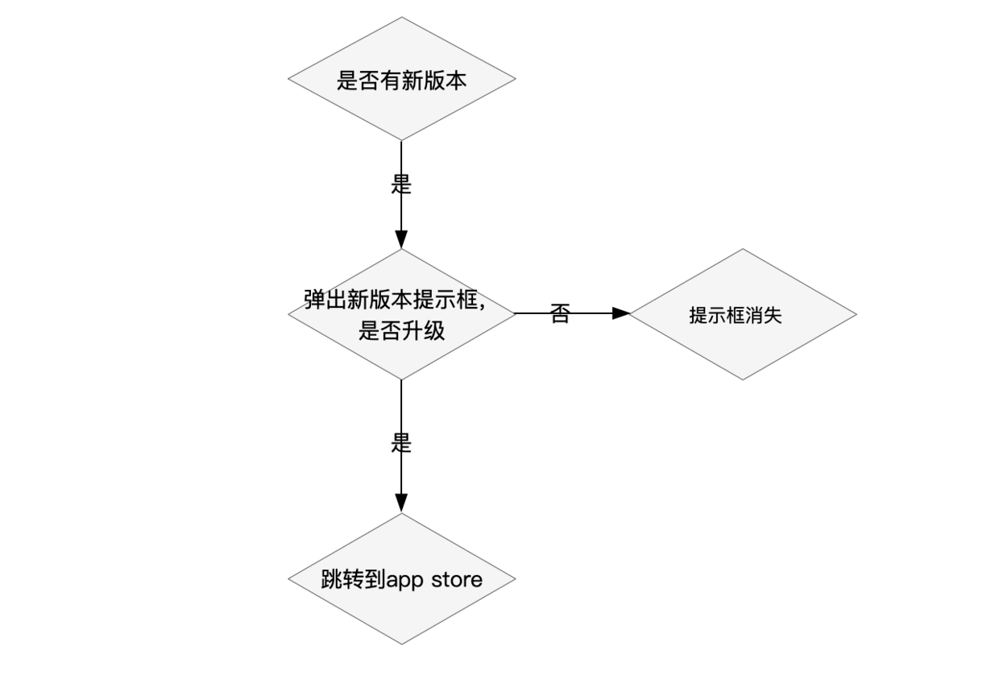
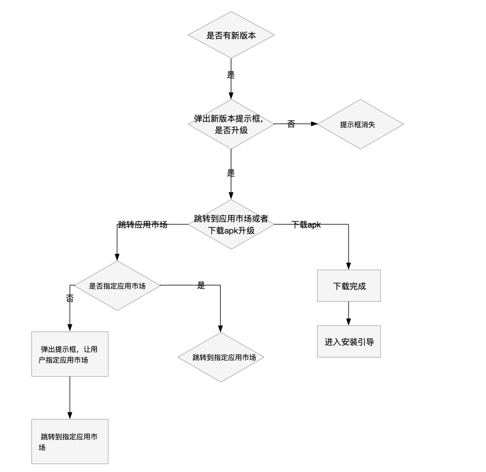

## Flutter 开发问题

### 软键盘弹起导致布局 overflow

> 原因：在 flutter 中，键盘弹起时会缩小 Scaffold 的高度并重建
> 1.当布局高度固定时，例如设置为屏幕高度，这时候键盘弹起页面上会出现布局 overflow 的提示 
> 2.软键盘弹起后遮挡输入框

- 方法一

1. 将`Scaffold`组件的`resizeToAvoidBottomInset`属性设置为`false`，这样在键盘弹出时布局将不会重建
2. 把固定的高度改为 `原高度 - MediaQuery.of(context).viewInsets.bottom`，键盘弹出时布局将重建，而这个`MediaQuery.of(context).viewInsets.bottom`变量在键盘弹出前是 0，键盘弹起后的就是键盘的高度

- 方法二

1. 布局放入可滚动的`Widget`中即可，当输入框获取焦点后，系统会自动将它滑动到可视区域

### 国际化问题

1. 文件名"l10n"为小写的 L
   > 我使用的是 I10n（带有大写字母 I）而不是 l10n（带有小写字母 l）。它发生在我得知 l10n 代表本地化时。
   > 所以我将 I10n.yaml 和 I10n 文件夹的名称从大写的“i”更改为小写的“L”，然后代码生成器就可以工作了。我觉得自己好傻 xD
   > 我还想指出，我现在什至不需要在任何地方进行导入，只需添加对 pubspec.yaml 的依赖和 'generate: true' 标志，并定义 l10n.yaml 和 l10n 文件夹，足以让代码生成器正常工作。
   > 谢谢您的帮助。我只是希望有一个注释可以帮助解决这个问题，因为现在到处都是，大写 I 的写法与小写 L 完全相同。

### 页面缓存（keeplive）

> 必须实现以下注释

```dart
// 该 MePage 组件必须用特定控件包裹，例如：PageView，TabBarView

// 1.必须是 StatefulWidget 组件
class MePage extends StatefulWidget {
  const MePage({Key? key}) : super(key: key);

  @override
  State<MePage> createState() => _MePageState();
}
// 2.混入 AutomaticKeepAliveClientMixin
class _MePageState extends State<MePage> with AutomaticKeepAliveClientMixin{

  // 3.重写 wantKeepAlive
  @override
  bool get wantKeepAlive => true;

  Widget build(BuildContext context) {
    super.build(context); // 4.调用父类 build
  }
}
```

## Flutter 应用问题

### Flutter App 升级功能流程

> 应用程序升级功能是 App 的基础功能之一，如果没有此功能会造成用户无法升级，应用程序的 bug 或者新功能老用户无法触达，甚至损失这部分用户。

#### 升级方式

**从平台方面来说：**

- IOS 平台，应用程序升级功能只能通过跳转到 app store 进行升级。
- Android 平台，既可以通过跳转到应用市场进行升级，也可以下载 apk 包升级。

**从强制性来说可以分别强制升级和非强制升级：**

- 强制升级：就是用户必须升级才能继续使用 App，如果不是非常必要不建议使用如此强硬的方式，会造成用户的反感。
- 非强制升级就是允许用户点击“取消”，继续使用 App。

#### 升级流程

**IOS 升级流程**

- IOS 升级流程如下：
  

- 流程说明：

1. 通常我们会访问后台接口获取是否有新的版本，如果有新的版本则弹出提示框，判断当前版本是否为“强制升级”，如果是则只提供用户一个“升级”的按钮，否则提供用户“升级”和“取消”按钮。
2. 弹出提示框后用户选择是否升级，如果选择“取消”，提示框消失，如果选择“升级”，跳转到 app store 进行升级。

**Android 升级流程**

- 相比 ios 的升级过程，Android 就稍显复杂了，流程图如下：
  

- 流程说明：

1. 访问后台接口获取是否有新的版本，这里和 IOS 是一样的，有则弹出升级提示框，判断当前版本是否为“强制升级”，如果是则只提供用户一个“升级”的按钮，否则提供用户“升级”和“取消”按钮。
2. 弹出提示框后有用户选择是否升级，如果选择“取消”，提示框消失，如果选择“升级”，判断是跳转到应用市场进行升级还是通过下载 apk 升级。
3. 如果下载 apk 升级，则开始下载 apk，下载完成后跳转到 apk 安装引导界面。
4. 如果跳转到应用市场升级，判断是否指定了应用市场，比如只在华为应用市场上架了，那么此时需要指定跳转到华为应用市场，即使你在很多应用市场都上架了，也应该根据用户手机安装的应用市场指定一个应用市场，让用户选择应用市场不是一个好的体验，而且用户也不知道应该去哪个市场更新，如果用户选择了一个你没有上架的应用市场，那就更尴尬了。
5. 指定应用市场后直接跳转到指定的应用市场的更新界面。

#### 增量更新

> Apple 不允许不经过 App Store 更新应用；在 App Store 上的更新 apple 自动做了增量计算，增量更新；12306 不是更新应用，而是更新应用本地的资源文件。

## Flutter 应用功能

### Flutter 第三方登录

#### 谷歌登录

**Android**

1. 前往[Firebase](https://console.firebase.google.com/)创建项目
2. 侧边栏进入 build -> Authentication -> Sign-in method，开启 Google 项
3. 侧边栏进入 Project Overview,创建 APP,进入 APP 设置，填写基本信息
4. 我们在使用第三方服务时一般要申请 key，而申请 key 一般需要包名或者 SHA1。一般这个 SHA1 值分为两种，测试版和发布版。可以分别通过 debug.keystore 和 release.keystore 获取。
5. 使用 keytool 创建 keystore，并获取 SHA-1、SHA-256，并填写到对应 APP 信息中, 如下(注意路径):

```sh
cd C:\Program Files\Java\jdk1.8.0_311\bin
keytool -list -v -keystore "C:\Users\Admin\.android\debug.keystore"
// 如果没有设置密码，直接回车，输入密码时有可能不显示任何东西，你只需要按照正确的输入即可，输入完后回车
// 确保debug.keystore文件已经存在
// 文件名称为：my-key-debug.keystore; 你可以输入命令keytool -list -v -keystore my-key-debug.keystore
```

6. 下载 google-services.json 放入 android/app/
7. 配置 OAuth 同意屏
8. 配置 android/build.gradle
9. 配置 android/app/build.gradle(注意 app 下的会有 JAVA 和 kotlin 代码可以复制)
10. 编写代码(下为示例)

```yaml
dependencies:
  firebase_auth: ^3.3.11 # Firebase 验证
    google_sign_in: ^5.2.4 # 谷歌登录
```

```dart
import 'package:flutter/material.dart';
import 'package:firebase_auth/firebase_auth.dart';
import 'package:google_sign_in/google_sign_in.dart';

class AllAuth {
  static final FirebaseAuth _auth = FirebaseAuth.instance;
  static final GoogleSignIn _googleSignIn = GoogleSignIn(
    scopes: [
      'email',
      'https://www.googleapis.com/auth/contacts.readonly',
    ],
  );
  static void signInWithGoogle() async {
    try {
      GoogleSignInAccount? googleUser = await _googleSignIn.signIn();
      GoogleSignInAuthentication googleAuth = await googleUser!.authentication;
      final AuthCredential credential = GoogleAuthProvider.credential(
        accessToken: googleAuth.accessToken,
        idToken: googleAuth.idToken,
      );
      print(googleAuth.accessToken);
      print(googleAuth.idToken);
      print(googleUser);

      // FirebaseUser user = (await _auth.signInWithCredential(credential)).user;
      // assert(user.email != null);
      // assert(user.displayName != null);
      // assert(!user.isAnonymous);
      // assert(await user.getIdToken() != null);
      // IdTokenResult idTokenResult = await user.getIdToken(refresh: true);
      // print(idTokenResult.token);
    } catch (e) {
      print(e.toString());
    }
  }
}

```

**IOS**

### Flutter 分析功能

#### 接入 Firebase Analytics

**安卓接入**

- 在 Firebase 项目中下载 google-services.json 到 android/app/google-services.json

- android/build.gradle 增加:

```gradle
buildscript {
    dependencies {
        classpath 'com.android.tools.build:gradle:4.1.0'
        classpath 'com.google.gms:google-services:4.3.10'
    }
}
```

- android/app/build.gradle 增加:

```gradle
apply plugin: 'com.google.gms.google-services' //谷歌统计
```

```yaml
dependencies:
  firebase_core: ^1.13.1 # 一个 Flutter 插件用来使用 Firebase Core API，从而可以连接到多个 Firebase 应用
  firebase_analytics: ^9.1.2 # 用于收集应用用户信息、分析用户行为
```

**IOS 接入**

- 下载 GoogleService-Info.plist 到 ios/Runner/GoogleService-Info.plist

**编写代码**

```dart
// main.dart
import 'package:flutter/material.dart';
import 'package:cheerfun_flutter/utils/firebase_analytics.dart';

void main() => runApp(MyApp());

class MyApp extends StatelessWidget {
  MyApp({Key? key}) : super(key: key);

  await Analytics().init();

  @override
  Widget build(BuildContext context) {
    return MaterialApp(
      navigatorObservers: [
        Analytics().firebaseAnalyticsObserver, //加入路由统计
      ],
    );
  }
}

```

```dart
// firebase_analytics.dart
import 'package:firebase_analytics/firebase_analytics.dart';

class Analytics {
  Analytics._internal();

  static final Analytics _instance = Analytics._internal();

  factory Analytics() {
    return _instance;
  }

  late FirebaseAnalytics analytics;
  late FirebaseAnalyticsObserver firebaseAnalyticsObserver;

  Future<void> init() async {
    WidgetsFlutterBinding.ensureInitialized();
    await Firebase.initializeApp();
    analytics = FirebaseAnalytics.instance;
    firebaseAnalyticsObserver = FirebaseAnalyticsObserver(analytics: analytics);
  }

  // 以下函数可在需要的地方调用
  // 可以自定义事件类型甚至传递某些有意义的参数
  Future<void> sendAnalyticsEvent() async {
    await analytics.logEvent(
      name: 'test_event',
      parameters: <String, dynamic>{
        'string': 'string',
        'int': 42,
        'long': 12345678910,
        'double': 42.0,
        'bool': true,
      },
    );
  }

  // 获取对应用户ID
  Future<void> sendSetUserId() async {
    await analytics.setUserId(id: "admin");
  }

  // 可以获取当前视图 并发送
  Future<void> sendSetCurrentScreen() async {
    await analytics.setCurrentScreen(
      screenName: 'store',
      screenClassOverride: 'storeDemo',
    );
  }
}
```

## IOS 问题

### iOS点击TextField不弹出软键盘

> 在模拟器里面，TextField可以通过电脑键盘输入，可是怎么也不会自动弹出模拟器软键盘

- 方法

1. 切换一下键盘，command + shift + k，因为Xcode只能是一种输入源